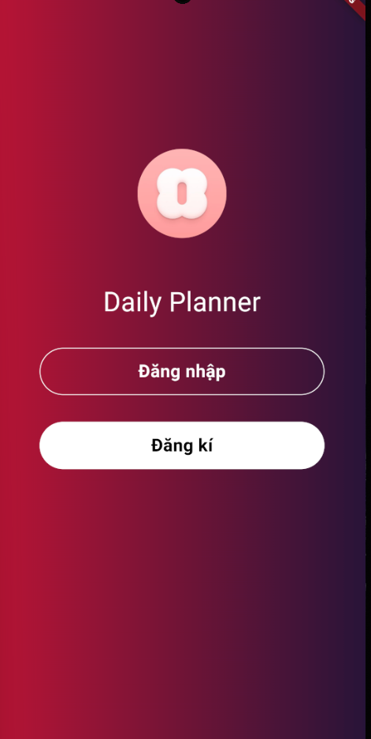
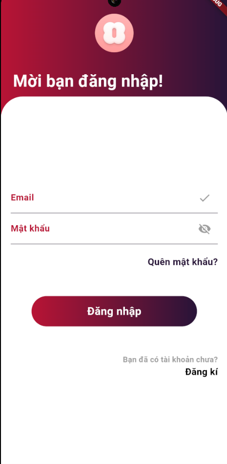
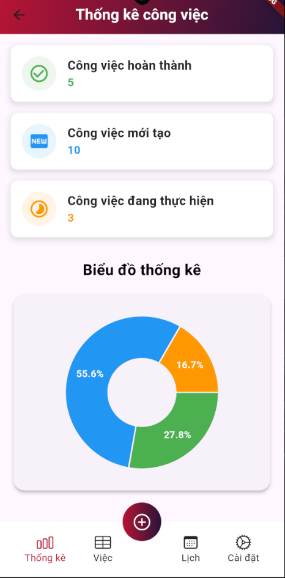
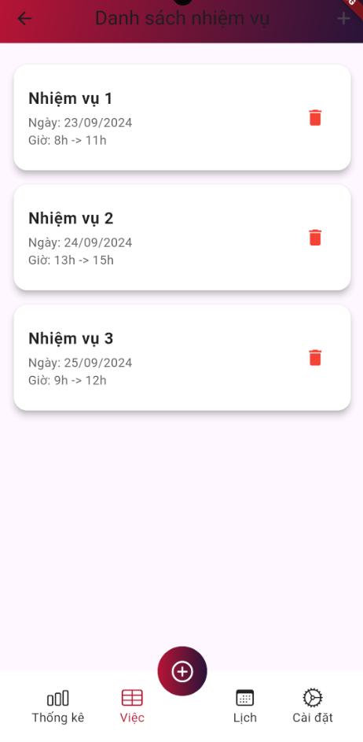
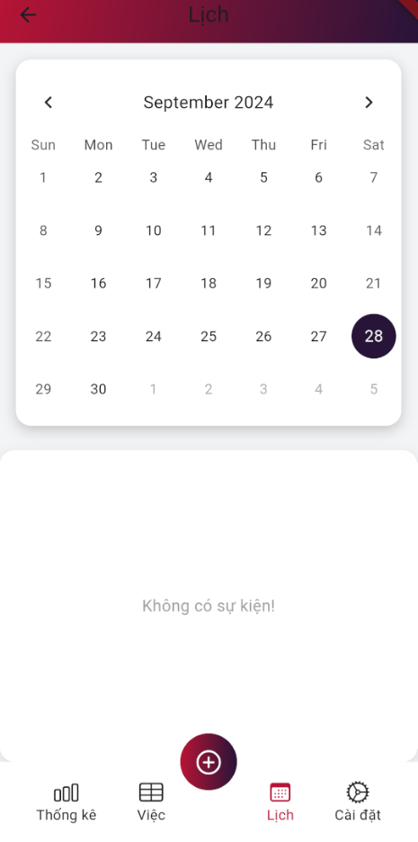
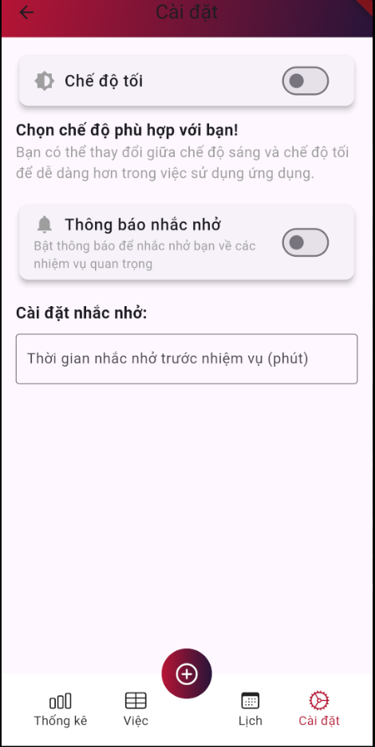
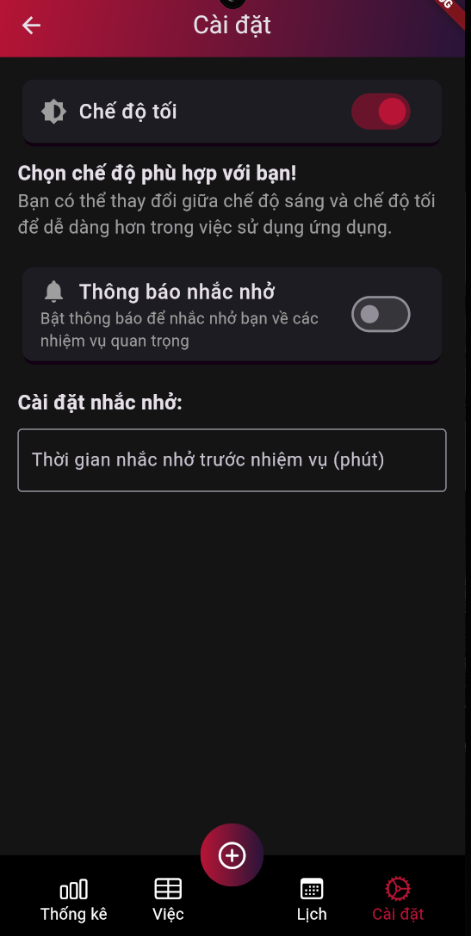
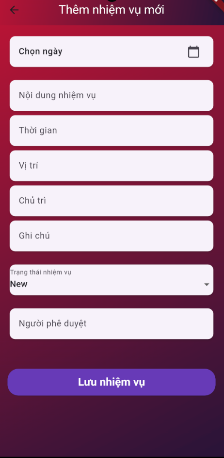
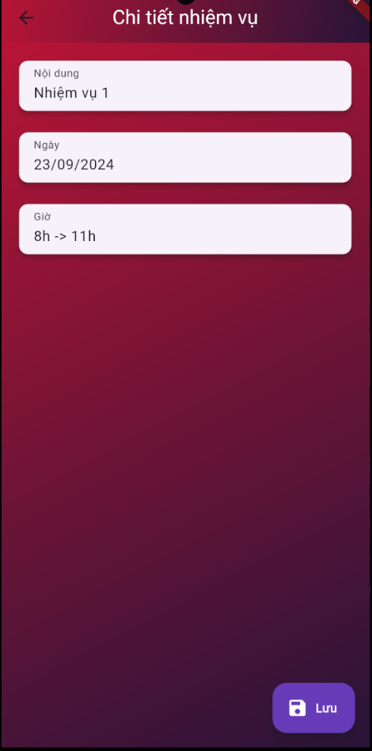

#dailyplanner
<!DOCTYPE html>
<html>
<head>

  

<h1 align="center">APP DAILY PLANNER</h1>

<h2 align="center">Chào mừng bạn đến với Ứng dụng quản lý thời gian!</h2>

Bạn đã sẵn sàng thiết lập lịch trình chưa? Hãy để chúng tôi giúp bạn biến mọi lịch trình thành hiện thực.

  </head>
  <body>
<h2 align="center">&#x1F4A1; I/ Mục đích dự án</h2>

- Mục đích của dự án app đặt lịch bao gồm:

- Giúp người dùng quản lý thời gian hiệu quả bằng cách tạo và theo dõi lịch trình cá nhân.

- Tạo ra một công cụ tiện ích giúp lên lịch các cuộc hẹn, công việc, và sự kiện hàng ngày hoặc hàng tuần.

- Tăng năng suất và sự tổ chức của người dùng bằng cách cung cấp các tính năng nhắc nhở và quản lý nhiệm vụ.

<h2 align="center"><i>&#x1F464;</i>II/ Thông tin thành viên:</h2>

<table style="width:100%;">
  <tr>
    <thead>
      <tr>
        <th>Số thứ tự</th>
        <th>Họ và Tên</th>
        <th>Account</th>
        <th>Chức danh</th>
        <th>Hình ảnh</th>
      </tr>
    </thead>
    <tbody>
      <tr>
        <td>1</td>
        <td>Bùi Quốc Thái</td>
        <td>quocthai25</td>
        <td>Dev</td>
        <td><a href="[https://www.facebook.com/minhtrile13](https://www.facebook.com/redd.thai.9/)"></td>
      </tr>
    </tbody>
  </table>

<h2 align="center">&#x2713; III/ Các trang giao diện của đồ án</h2>

 
  <table>
    <thead>
      <tr>
        <th>Các trang giao diện của App</th>
      </tr>
    </thead>
    <tbody>
      <tr>
        <td>- Đăng nhập - Trang Welcome - Add Task List - Calendar - Task List - Setting - Trang thống kê</td>
      </tr>
    </tbody>
  </table>

<h2 align="center">&#x274C; IV/ Các giao diện cơ bản mà App chưa có</h2>

  <table style="width:100%;">
    <thead>
      <tr>
        <th>STT</th>
        <th>Giao diện</th>
      </tr>
    </thead>
    <tbody>
      <tr>
        <td>1</td>
        <td>- Đăng kí</td>
      </tr>
      <tr>
        <td>2</td>
        <td>- Quên mật khẩu</td>
      </tr>
      <tr>
        <td>3</td>
        <td>- Giao diện chỉnh sửa form chữ cho người dùng</td>
      </tr>
    </tbody>
  </table>

  <h2 align="center">&#x1F4F7; V/ Một số hình ảnh của App</h2>

        <table>
            <tr>
                <td></td>
                <td></td>
            </tr>
        </table>
    

<h3 align="center">Welcome page , Login page</h3>

        <table>
            <tr>
                <td></td>
                <td></td>
            </tr>
        </table>
    

<h3 align="center">Thống kê page , Task List page</h3>

        <table>
            <tr>
                <td></td>
                <td></td>
            </tr>
        </table>
    

<h3 align="center">Canlendar page , Setting page</h3>

        <table>
            <tr>
                <td></td>
            </tr>
        </table>
    

<h3 align="center">Dark mode</h3>

        <table>
            <tr>
                <td></td>
                <td></td>
            </tr>
        </table>
    

<h3 align="center">Add Task page , Detail Task page</h3>
<h2 align="center"><i>&#x2692;</i>VI/ Các công cụ hỗ trợ</h2>

  
  
  

<h2 align="center">&#x1F52D; VII/ Phương hướng phát triển</h2>

<table style="width:100%;">
  <tr>
    <thead>
      <tr>
        <th>Các phương hướng phát triển</th>
      </tr>
    </thead>
    <tbody>
      <tr>
        <td>- Tích hợp thông báo nhắc nhở: Phát triển tính năng gửi thông báo nhắc nhở cho người dùng về các cuộc hẹn hoặc nhiệm vụ sắp tới. Điều này giúp họ không bỏ lỡ các sự kiện quan trọng.</td>
      </tr>
      <tr>
        <td>- Đồng bộ hóa với lịch ngoài: Cho phép đồng bộ lịch của ứng dụng với các nền tảng khác như Google Calendar, Outlook hoặc Apple Calendar để người dùng có thể quản lý lịch trình một cách dễ dàng và tập trung.</td>
      </tr> 
      <tr>
        <td>- Gợi ý lịch thông minh: Sử dụng trí tuệ nhân tạo (AI) để đề xuất khung giờ thích hợp cho việc đặt lịch, dựa trên lịch trình sẵn có của người dùng và thời gian trống còn lại.</td>
      </tr> 
      <tr>
        <td>- Tùy chỉnh giao diện: Cung cấp nhiều tùy chọn về giao diện và màu sắc để người dùng cá nhân hóa ứng dụng theo sở thích cá nhân, giúp trải nghiệm người dùng trở nên tốt hơn.</td>
      </tr> 
      <tr>
        <td>- Chia sẻ và mời tham gia sự kiện: Cho phép người dùng chia sẻ sự kiện với bạn bè hoặc đồng nghiệp qua email, tin nhắn hoặc liên kết trực tiếp, giúp việc đặt lịch hẹn nhóm trở nên thuận tiện hơn.</td>
      </tr> 
    </tbody>
  </table>

</body>
<footer>
  

  
    

</footer>
</html>
  
  
